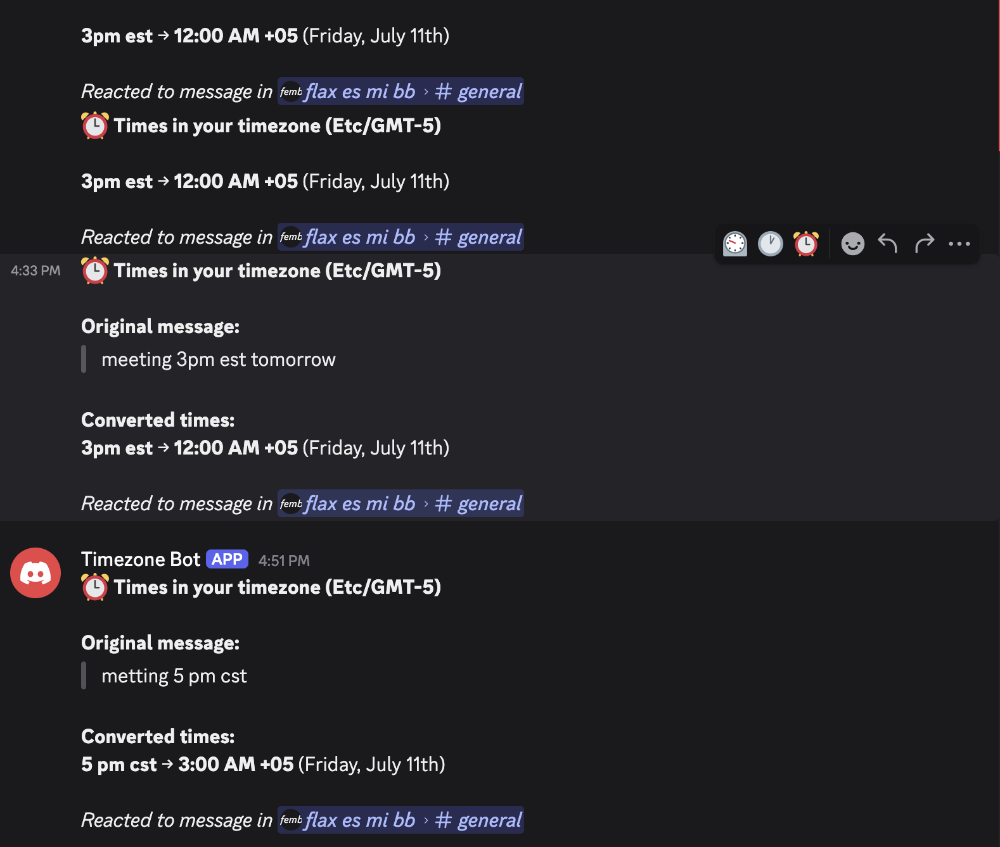
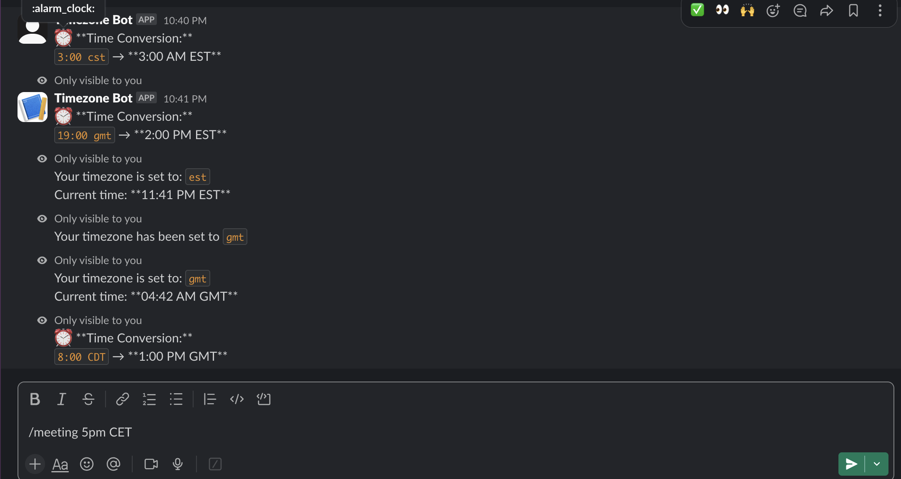
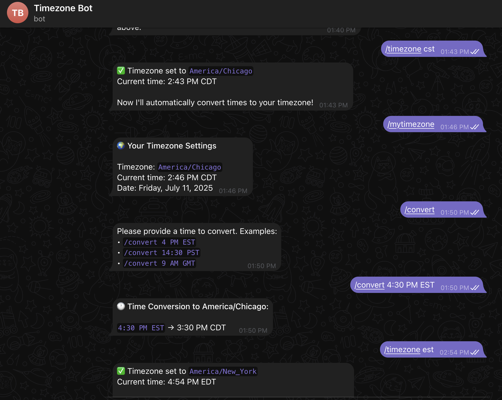

# Bot de Zonas Horarias


Este bot fue creado con la intención de facilitar y agilizar la conversión de zonas horarias dentro de mensajes en **Discord**/**Slack**/**Telegram**.

## Plataformas Disponibles
| Discord | Slack | Telegram |
|---------|-------|----------|
| [](https://discord.com/oauth2/authorize?client_id=1392192666053251143&permissions=8&integration_type=0&scope=bot+applications.commands)  | [](https://slack.com/oauth/v2/authorize?client_id=9180592732466.9175325235619&scope=channels:read,chat:write,app_mentions:read,channels:history,groups:history,im:history,commands&user_scope=)  | [](https://t.me/TimeZone123Bot)  |

## ¿Qué hace?

Este bot responde a los siguientes comandos:

| Comando                  | Descripción                                                                                  |
|--------------------------|----------------------------------------------------------------------------------------------|
| `/time <hora> <zona>`    | Convierte la hora dada en la zona horaria especificada a tu zona local y zonas populares.    |
| `/settimezone <zona>`    | Establece tu zona horaria preferida para futuras conversiones.                               |
| `/mytimezone`            | Muestra tu zona horaria guardada actualmente.                                                |
| `/help`                  | Muestra ayuda e instrucciones de uso del bot.                                                |
| Reacciona con ⏰ (Discord) | Envía un mensaje privado con las conversiones de hora para la hora mencionada en el mensaje. |

Siempre responde con mensajes efímeros con la intención de no interferir en la conversación de los canales.

## Cómo ejecutarlo tú mismo

Si quieres ejecutar una versión local del bot, esto es lo que necesitas saber:

### Requisitos

**Requisitos generales:**
- Node.js 16+ (para el bot de Discord)
- Python 3.8+ (para los bots de Slack y Telegram)
- Tokens de bot y credenciales de API de cada plataforma:
  - **Discord**: [Portal de Desarrolladores de Discord](https://discord.com/developers/applications)
  - **Slack**: [Panel de API de Slack](https://api.slack.com/apps)
  - **Telegram**: [@BotFather](https://t.me/BotFather) en Telegram

> Después de descargar o clonar este repositorio puedes ir a cada plataforma y comenzar

### Configuración del Bot de Discord
Dentro del directorio /Discord:
```bash
npm install
cp .env.example .env #rellena con tus datos
npm run register
npm run dev
```
> **Recuerda**: Copia `.env.example` a `.env` y completa tus credenciales del bot de Discord desde el [Portal de Desarrolladores de Discord](https://discord.com/developers/applications)

### Configuración del Bot de Slack
Dentro del directorio /Slack:
```bash
cd Slack/
pip install -r requirements.txt
cp .env.example .env
python oauth_server.py
python app.py
```
> **Recuerda**: Copia `.env.example` a `.env` y completa tus credenciales de la app de Slack desde el [Panel de API de Slack](https://api.slack.com/apps)

### Configuración del Bot de Telegram  
Dentro del directorio /Telegram:
```bash
pip install -r requirements.txt
cp .env.example .env
python app.py
python web_server.py
```
> **Recuerda**: Copia `.env.example` a `.env` y completa tu token de bot desde [@BotFather](https://t.me/BotFather) en Telegram

## Licencia

Este proyecto está bajo la Licencia MIT, consulta LICENSE.md para más información.
