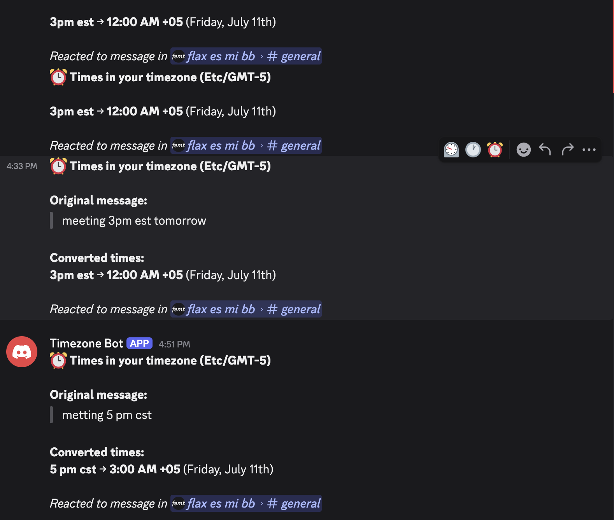
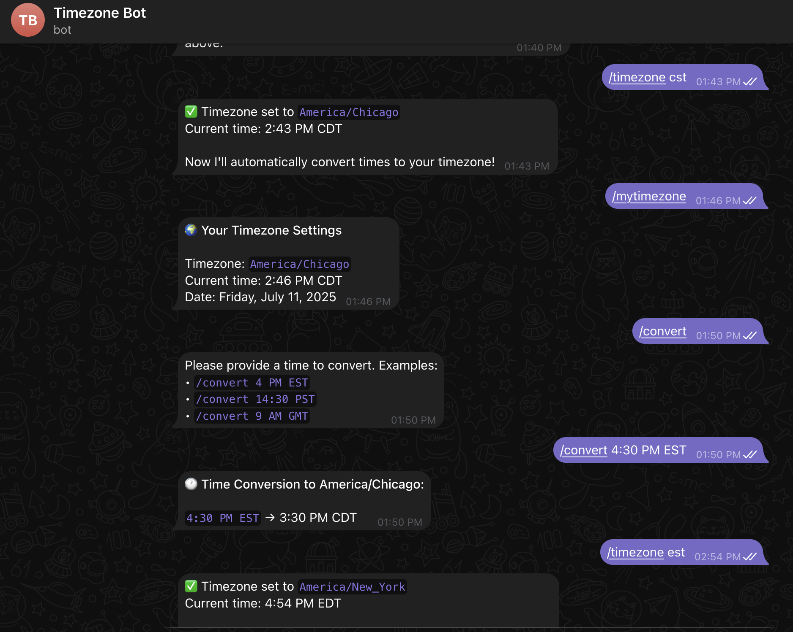

> 📖 🇪🇸 También disponible en español: [README.es.md](README.es.md)

# Timezone Bot


A bot to help you convert different timezones inside messages in **Discord**/**Slack**/**Telegram**.This bot doesnt interfere with other messages in the channel so its perfect for big servers.

## Available Platforms

| Discord | Slack | Telegram |
|---------|-------|----------|
| [](https://discord.com/oauth2/authorize?client_id=1392192666053251143&permissions=8&integration_type=0&scope=bot+applications.commands)  | [](https://slack.com/oauth/v2/authorize?client_id=9180592732466.9175325235619&scope=channels:read,chat:write,app_mentions:read,channels:history,groups:history,im:history,commands&user_scope=)  | [](https://t.me/TimeZone123Bot)  |

## What it does

Got teammates in different time zones? This bot helps you figure out what time it is for everyone.

- **Type a time**, get it converted to your timezone
- **React with a clock emoji** on Discord to convert any message
- **Works the same way** on Discord, Slack, and Telegram
- **Remembers your timezone** once you set it


## Running it yourself

Want to run your own version? Here are the steps to follow:

### Discord Bot Setup
```bash
cd Discord/
npm install                 # Installs express, discord-interactions, ws, moment-timezone
cp .env.example .env       # Copy environment template and fill with your tokens
npm run register           # Registers slash commands with Discord API
npm run dev               # Starts Express server on port 3000
```
> 💡 **Setup tip**: Copy `.env.example` to `.env` and fill in your Discord bot credentials from the [Discord Developer Portal](https://discord.com/developers/applications)

### Slack Bot Setup
```bash
cd Slack/
pip install -r requirements.txt  # Installs slack-bolt, flask, pytz
cp .env.example .env             # Copy environment template and fill with your tokens
python oauth_server.py           # Start OAuth server (port 8944)
python app.py                    # Start main bot (separate process)
```
> 💡 **Setup tip**: Copy `.env.example` to `.env` and fill in your Slack app credentials from the [Slack API Dashboard](https://api.slack.com/apps)

### Telegram Bot Setup  
```bash
cd Telegram/
pip install -r requirements.txt  # Installs pyTelegramBotAPI, pytz
cp .env.example .env             # Copy environment template and fill with your token
python app.py                    # Start bot with long polling
```
> 💡 **Setup tip**: Copy `.env.example` to `.env` and fill in your bot token from [@BotFather](https://t.me/BotFather) on Telegram

## How it works technically

### Core Timezone Logic
All platforms use the same timezone conversion algorithm:

1. **Parse time from text** using regex patterns (supports 12/24hr formats, AM/PM, timezones)
2. **Resolve timezone aliases** via shared `timezones.json` (EST→America/New_York, etc.)
3. **Convert using timezone libraries**:
   - Node.js: `moment-timezone`
   - Python: `pytz` 
4. **Format output** showing original time → user's timezone → 2-3 other popular zones

### Platform-Specific Implementation

**Discord**: 
- Slash commands (`/time`, `/timezone`) handled via Express webhook
- Reaction-based conversion uses WebSocket gateway to detect ⏰ emoji reactions
- Private ephemeral responses to avoid channel spam

**Slack**:
- Socket Mode connection handles real-time events (mentions, DMs, slash commands)
- OAuth server runs separately on Flask for workspace installations
- Threading support preserves conversation context

**Telegram**:
- Long polling continuously checks for new messages
- Inline commands and direct messages both supported
- No OAuth complexity - simple bot token authentication

### Shared Data Management
- **User preferences**: JSON file stores timezone per user ID across all platforms
- **Timezone aliases**: 200+ common abbreviations mapped to IANA timezone names
- **Cross-platform consistency**: Same timezone logic and response format everywhere

## Architecture & Frameworks

This project uses different frameworks for each platform, optimized for their respective APIs and ecosystems:

### Discord Bot (Node.js/Express)
- **Framework**: Express.js with Discord.js Interactions
- **Language**: JavaScript (ES6 modules)
- **Key Libraries**: 
  - `discord-interactions` - Handles Discord slash commands and message interactions
  - `express` - HTTP server for Discord webhook interactions
  - `ws` - WebSocket support for real-time Discord events
  - `moment-timezone` - Timezone conversion logic
- **Architecture**: Uses Discord's interaction-based API with webhooks for slash commands and WebSocket gateway for reaction events
- **File Structure**:
  - `bot.js` - Main bot logic with Express server and Discord event handlers
  - `register.js` - Registers slash commands with Discord API

### Slack Bot (Python/Flask + Slack Bolt)
- **Framework**: Flask for OAuth + Slack Bolt for bot functionality  
- **Language**: Python 3.8+
- **Key Libraries**:
  - `slack-bolt` - Official Slack SDK for building apps with socket mode
  - `flask` - Web framework for OAuth flow and webhook endpoints
  - `pytz` - Python timezone handling
- **Architecture**: Dual-server setup:
  - `app.py` - Main bot using Slack Bolt's Socket Mode for real-time events
  - `oauth_server.py` - Separate Flask server handling OAuth installation flow
- **Why this setup**: Slack requires OAuth for workspace installation, while Bolt handles real-time messaging

### Telegram Bot (Python/pyTelegramBotAPI)
- **Framework**: pyTelegramBotAPI (telebot)
- **Language**: Python 3.8+
- **Key Libraries**:
  - `pyTelegramBotAPI` - Lightweight Python wrapper for Telegram Bot API
  - `pytz` - Timezone conversions
- **Architecture**: Simple polling-based bot that processes updates directly from Telegram API
- **File Structure**: Single `app.py` file - simplest implementation as Telegram's API is the most straightforward

### Shared Components
All platforms share common configuration and data:
- **timezones.json** - 200+ timezone aliases (EST→America/New_York, etc.) and popular timezone lists
- **user_preferences.json** - Cross-platform user timezone storage (Discord/Slack/Telegram user IDs)
- **response_messages.json** - Standardized bot responses with platform-specific formatting

### Why Different Frameworks?

1. **Discord (Node.js/Express)**: 
   - Discord's API is optimized for JavaScript/WebSocket interactions
   - Express handles webhook-based slash commands efficiently
   - Real-time reaction events need WebSocket gateway connection

2. **Slack (Python/Flask + Bolt)**:
   - Slack Bolt SDK provides robust event handling and middleware
   - Flask needed separately for OAuth workflow (workspace installation)
   - Socket Mode eliminates need for public webhooks

3. **Telegram (Python/telebot)**:
   - Simplest API of the three platforms
   - No OAuth required - direct bot token authentication
   - Polling-based approach works perfectly for timezone conversion use case


## Project structure

```
timezone-bot/
├── Discord/           # Discord bot (Node.js + Express)
│   ├── bot.js        # Main bot logic + Express server
│   ├── register.js   # Discord slash command registration
│   └── package.json  # Dependencies: express, discord-interactions, ws
├── Slack/            # Slack bot (Python + Flask + Bolt)
│   ├── app.py        # Main bot using Slack Bolt SDK
│   ├── oauth_server.py # Flask server for OAuth installation
│   └── requirements.txt # Dependencies: slack-bolt, flask, pytz
├── Telegram/         # Telegram bot (Python + pyTelegramBotAPI)
│   ├── app.py        # Main bot logic
│   └── requirements.txt # Dependencies: pyTelegramBotAPI, pytz
└── shared/           # Cross-platform shared data
    ├── timezones.json      # 200+ timezone aliases & popular zones
    ├── user_preferences.json # User timezone settings (all platforms)
    └── response_messages.json # Standardized bot responses
```

## Contributing

Want to help? Great!

1. Fork the repo
2. Make your changes
3. Test them
4. Submit a pull request

## License

MIT License - do whatever you want with it.